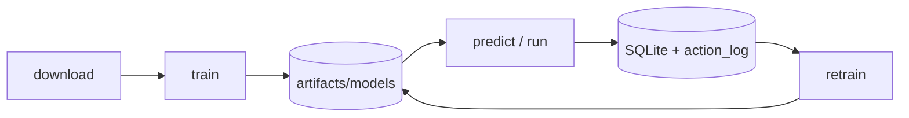

# Get Started with epochAI

A simple, command-first guide from a fresh clone to a trained predictor and paper-trading
bot. Pick your **hardware profile** (CPU, low-end GPU, or high-end GPU) and follow that
column — every step works the same way, only a few `--set` flags change.

Run **all commands from the repository root**.

> **Paper-only by default.** Research and education software — not financial advice.
> Real-money order routing stays disabled unless you explicitly enable live mode with keys.

---

## What you are building

epochAI learns **out-of-sample** on historical 1-minute BTC/USDT data, predicts six
horizons (1m → 1h) with calibrated P(up) and quantile bands, and feeds a separate
**execution layer** that turns forecasts into paper trades.



The flow is always the same: **setup → download → train → predict → run → retrain.**

---

## Pick your hardware profile

| Profile | Use when | `model.device` | Key flags (added at train time) |
| --- | --- | --- | --- |
| **CPU** | No NVIDIA GPU | `cpu` | smaller population/generations; `torch_compile=false` |
| **GPU low** | 4–8 GB NVIDIA (GTX 1650, T4, 3060) | `cuda` | `cuda_worker_cap_max=2`, `cuda_batch_cap=512`, `torch_compile=false` |
| **GPU high** | 24–48 GB NVIDIA (3090, 4090, A6000) | `cuda` | `successive_halving=true`, bigger search, `cuda_batch_cap=4096` |

If you set nothing, the defaults auto-detect: `model.device=auto` uses CUDA when present
(else CPU), `cuda_auto_workers` picks a worker count from GPU VRAM, and `cuda_auto_batch`
scales the batch size. The profile flags below just push harder (high-end) or pull back
(low-end) than the auto defaults.

---

## 0. One-time setup (all profiles)

```powershell
python -m venv .venv
.venv\Scripts\Activate.ps1
pip install -r requirements.txt -r requirements-dev.txt
```

Linux/macOS: use `python3 -m venv .venv`, `source .venv/bin/activate`.

Then install **PyTorch** (required for the default `evolved_nn` model). Choose the build
that matches your profile:

```powershell
# CPU profile (no GPU)
pip install torch

# GPU profiles (CUDA build — check pytorch.org for your CUDA version)
pip install torch --index-url https://download.pytorch.org/whl/cu121
```

Optional extras (live exchange downloads, Telegram, API, MLflow, xgboost):

```powershell
pip install -r requirements-optional.txt
# at minimum, for live data:  pip install ccxt
```

**Linux GPU + `torch.compile`:** Triton JIT needs Python dev headers. If training later
crashes with `Python.h: No such file or directory`, install them
(`apt install python3.12-dev`) or just keep `model.nn.torch_compile=false` (the low-end
profile already disables it).

Confirm the install and resolved config:

```powershell
python -m epoch_ai info
```

---

## 1. Download market data (all profiles)

**Required before the first train.** The downloader fetches OHLCV plus context feeds,
cleans them, and caches parquet under `artifacts/data/`. Later commands read this cache —
they do not hit the exchange unless the cache is missing or you ask them to refresh.

```powershell
# Needs ccxt + network. --bars N fetches the most recent N bars.
python -m epoch_ai download --bars 87000
```

Why 87000? The default 1-minute config keeps ~30 days (`initial_train_period=43200`) for
the first training window, and feature warm-up/label filtering drops roughly half the
rows. **~87,000 raw bars** is the practical minimum for a real default-config train.

No network or geo-blocked? Use the deterministic synthetic fallback for an offline smoke:

```powershell
python -m epoch_ai download --bars 8000 `
  --set data.use_synthetic_fallback=true --set data.context_symbols=[]
```

| Flag | Purpose |
| --- | --- |
| `--bars N` | Fetch the most recent N bars |
| `--force` | Re-download primary symbol even if cached |
| `--symbol ETH/USDT` | Override primary symbol |
| `--set data.use_synthetic_fallback=true` | Offline synthetic data |
| `--set data.context_symbols=[]` | Skip context coins (faster) |

Re-running `download` **extends** the cache forward from the last cached timestamp.

---

## 2. Train (choose your profile)

This is the core walk-forward loop: train on the oldest window → predict the next unseen
slice → log the outcome → expand the window → repeat. `--log-predictions` records
out-of-sample results to SQLite so the retrain loop has data later.

### CPU

`evolved_nn` on CPU is fully supported but slow, so shrink the search. Best for smokes,
small configs, or overnight runs:

```powershell
python -m epoch_ai train --bars 87000 --log-predictions `
  --set model.device=cpu `
  --set model.nn.torch_compile=false `
  --set model.evolution.population_size=6 `
  --set model.evolution.generations=4
```

For a quick minutes-long plumbing check on any machine, shrink the windows too:

```powershell
python -m epoch_ai download --bars 8000
python -m epoch_ai train --bars 8000 --max-steps 12 --log-predictions `
  --set model.device=cpu `
  --set walk_forward.initial_train_period=800 `
  --set walk_forward.step_size=200 `
  --set execution.min_buffer_bars=500 `
  --set model.evolution.fast_fit=true
```

### GPU low (4–8 GB)

Keep parallel candidates and batches small so you don't run out of VRAM:

```powershell
python -m epoch_ai train --bars 87000 --log-predictions `
  --set model.device=cuda `
  --set model.evolution.cuda_worker_cap_max=2 `
  --set model.nn.cuda_batch_cap=512 `
  --set model.nn.batch_size=128 `
  --set model.nn.torch_compile=false
```

Turning on `model.evolution.successive_halving=true` also helps weak GPUs finish sooner.

### GPU high (24–48 GB)

Open up parallelism and batch size, enable successive halving, and reinvest the freed
time into a larger architecture search:

```powershell
python -m epoch_ai train --bars 87000 --log-predictions `
  --set model.device=cuda `
  --set model.evolution.successive_halving=true `
  --set model.evolution.cuda_worker_cap_max=12 `
  --set model.evolution.population_size=24 `
  --set model.evolution.generations=12 `
  --set model.nn.cuda_batch_cap=4096
```

### Common train flags

| Flag | When to use |
| --- | --- |
| `--bars N` | Cap to N cached bars (use ≥ 87000 with default config) |
| `--log-predictions` | Write OOS predictions/outcomes to SQLite (needed for `retrain`) |
| `--max-steps N` | Cap walk-forward iterations (smokes) |
| `--refresh-data` | Re-download OHLCV before training (default is cache-only) |
| `--full-history` | Backfill multi-year history from exchange start (slow) |
| `--fresh` | Delete checkpoint and restart from step 0 |
| `--no-resume` | Ignore checkpoint but keep the file |
| `--set model.evolution.fast_fit=true` | Skip evolution for a quick plumbing test |

Long runs checkpoint after each step (`artifacts/checkpoints/`). Press **Ctrl+C** to pause,
then re-run the same `train` command to resume. Watch progress without training:

```powershell
python -m epoch_ai progress
python -m epoch_ai progress --watch --interval 5
```

When training completes you'll see a summary with the model version and step count;
models land in `artifacts/models/v_*/`.

### Tuning quick reference

| Knob | Default | CPU | GPU low | GPU high |
| --- | --- | --- | --- | --- |
| `model.device` | `auto` | `cpu` | `cuda` | `cuda` |
| `model.evolution.population_size` | `12` | `6` | `12` | `24` |
| `model.evolution.generations` | `8` | `4` | `8` | `12` |
| `model.evolution.cuda_worker_cap_max` | `12` | – | `2` | `12` |
| `model.evolution.successive_halving` | `false` | `false` | `true` | `true` |
| `model.nn.batch_size` | `256` | `256` | `128` | `256` |
| `model.nn.cuda_batch_cap` | `2048` | – | `512` | `4096` |
| `model.nn.torch_compile` | `true` | `false` | `false` | `true` |
| `model.cuda.matmul_precision` | `high` | – | `high` | `high` |

You can also set any of these permanently in `config/config.yaml` instead of repeating
`--set` flags (search "Weak GPU example" / "High-end example" for ready-made blocks).

---

## 3. Inspect forecasts

Multi-horizon forecast for the latest bar using the promoted champion model:

```powershell
python -m epoch_ai predict
python -m epoch_ai predict --json
```

---

## 4. Run the bot (paper / replay)

Load the registry model and simulate bar-by-bar execution. Near-random data hugs
P(up)≈0.5, so the `--*-threshold 0.5` flags force directional trades for a visible demo.

```powershell
# Historical replay tail (most common)
python -m epoch_ai run --bars 6000 --live-bars 300 --replay `
  --log-predictions --long-threshold 0.5 --short-threshold 0.5

# Simulated live feed (offline-safe)
python -m epoch_ai run --live-feed --bars 6000 --live-bars 300 --log-predictions
```

Session state (open position, equity) persists to `artifacts/session_state.json` across
restarts.

---

## 5. Keep improving (retrain loop)

After the first full train, refresh data and improve on a cadence. Pick **one**:

```powershell
# A. Simple retrain from logged predictions (needs prior --log-predictions runs)
python -m epoch_ai download --bars 87000
python -m epoch_ai retrain --min-new-samples 50

# B. Full walk-forward retrain on updated history
python -m epoch_ai train --bars 87000 --log-predictions

# C. Safe auto-retrain: train a challenger, promote only if it beats the champion
python -m epoch_ai auto-retrain

# D. Scheduled daily loop (run under cron / Task Scheduler in production)
python -m epoch_ai schedule-retrain --promote --interval-hours 24 --max-cycles 1000
```

Use the **same profile `--set` flags** from Step 2 on `retrain` / `train` here too.

---

## Cheat sheet (first full pass)

```powershell
# Setup (once)
python -m venv .venv
.venv\Scripts\Activate.ps1
pip install -r requirements.txt -r requirements-dev.txt
pip install torch          # add --index-url .../cu121 for GPU
pip install ccxt

# Verify, download, train, run
python -m epoch_ai info
python -m epoch_ai download --bars 87000

# --- train: use the line for YOUR profile ---
# CPU:
python -m epoch_ai train --bars 87000 --log-predictions --set model.device=cpu `
  --set model.nn.torch_compile=false `
  --set model.evolution.population_size=6 --set model.evolution.generations=4
# GPU low:
python -m epoch_ai train --bars 87000 --log-predictions --set model.device=cuda `
  --set model.evolution.cuda_worker_cap_max=2 --set model.nn.cuda_batch_cap=512 `
  --set model.nn.batch_size=128 --set model.nn.torch_compile=false
# GPU high:
python -m epoch_ai train --bars 87000 --log-predictions --set model.device=cuda `
  --set model.evolution.successive_halving=true `
  --set model.evolution.population_size=24 --set model.evolution.generations=12 `
  --set model.nn.cuda_batch_cap=4096

# Verify + paper run
python -m epoch_ai predict --json
python -m epoch_ai run --bars 6000 --live-bars 300 --replay `
  --log-predictions --long-threshold 0.5 --short-threshold 0.5

# Ongoing
python -m epoch_ai auto-retrain
```

---

## Command reference

| Command | Purpose |
| --- | --- |
| `info` | Print resolved YAML config |
| `download` | Fetch/cache OHLCV + context (run before train) |
| `train` | Progressive walk-forward train + registry (primary) |
| `progress` | Walk-forward position; `--watch` for live view |
| `predict` | Multi-horizon forecast table / `--json` |
| `run` | Load registry model; paper / replay / live-feed |
| `retrain` | Retrain from SQLite logs or parquet fallback |
| `auto-retrain` | Challenger/champion gate; `--promote-policy` for PPO |
| `schedule-retrain` | Periodic retrain loop (`--promote`) |
| `train-policy` | Train optional PPO trading policy on OOS replay |
| `evaluate-holdout` | Score predictor + policy on the untouched final tail |
| `backtest` | Walk-forward + trading metrics report |
| `tune` / `promote` | Config sweep and best-experiment export |
| `export` | Open-weights bundle + model card |
| `serve` / `telegram` | HTTP API / optional bot |
| `kill-switch` | Halt or resume live trading globally |

Global flags on most commands: `--config path`, `--symbol BTC/USDT`, `--set key=value`, `-v`.

---

## Where artifacts live

| Path | Contents |
| --- | --- |
| `artifacts/data/*.parquet` | Cached market history |
| `artifacts/models/v_*/` | Versioned open-weights models |
| `artifacts/models/current.json` | Promoted champion pointer |
| `artifacts/checkpoints/` | Walk-forward resume JSON |
| `artifacts/logs/predictions.sqlite` | Prediction/outcome store (cumulative) |
| `artifacts/logs/action_log.jsonl` | Bot experience for feedback retrain |
| `artifacts/policy/` | PPO policy + promoted champion |
| `artifacts/session_state.json` | Paper session snapshot |

Do not delete `artifacts/` casually — SQLite logs and checkpoints are cumulative.

---

## Development checks

```powershell
.venv\Scripts\ruff.exe check .
.venv\Scripts\python.exe -m pytest -m "not slow"
.venv\Scripts\python.exe -m pytest
```

---

## Further reading

- `README.md` — overview and progressive-learning parameters
- `docs/runbook.md` — operator runbook (kill switch, treasury, live seam)
- `docs/adr/0008-multi-horizon-and-learned-policy.md` — multi-head + RL boundary
- `AGENTS.md` — agent/cloud gotchas (synthetic fallback, fast smokes)
