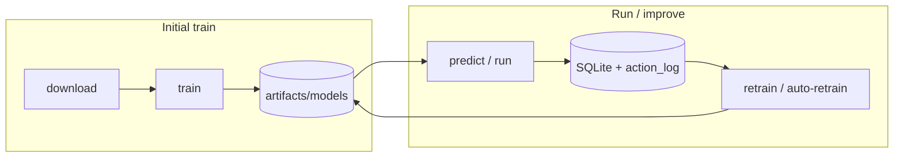

# Get Started with epochAI

Command-first guide from zero to a trained multi-horizon predictor, paper-trading bot,
and ongoing retrain loop. Run everything from the **repository root**.

> **Paper-only by default.** This software is for research and education — not financial
> advice. Real-money order routing is intentionally unimplemented unless you explicitly
> enable live mode with exchange keys.

---

## What you are building

epochAI learns **out-of-sample** on historical 1m BTC/USDT data, then predicts six
horizons (1m → 1hr) with calibrated P(up) and quantile bands. A separate **execution
layer** (baseline ensemble or optional PPO policy) turns forecasts into paper trades.



---

## 0. One-time setup

```powershell
# Windows (from repo root)
python -m venv .venv
.venv\Scripts\Activate.ps1
pip install -r requirements.txt
pip install -r requirements-dev.txt

# PyTorch required for default model (evolved_nn) and optional PPO policy
pip install torch

# Optional: live CCXT downloads, Telegram, FastAPI, MLflow, xgboost
pip install -r requirements-optional.txt
```

Linux/macOS: use `.venv/bin/python` and `source .venv/bin/activate` instead.

---

## 1. Inspect configuration

Default config: `config/config.yaml` (1m base, multi-horizon heads, walk-forward params).

```powershell
python -m epoch_ai info
```

Override any knob for a single run (repeat `--set` as needed):

```powershell
python -m epoch_ai train --set walk_forward.step_size=1440 --set model.device=cuda
```

Key defaults to know before the first train:

| Config area | Default | Meaning |
| --- | --- | --- |
| `timeframe` | `1m` | Base candle size |
| `prediction.horizons` | `[1,5,10,15,30,60]` | Multi-head forecast windows |
| `walk_forward.initial_train_period` | `43200` | ~30 days of 1m bars before first OOS step |
| `walk_forward.step_size` | `1440` | ~1 day advanced per walk-forward step |
| `model.backend` | `evolved_nn` | Evolutionary PyTorch MLP (multi-head) |
| `trading.policy_backend` | `baseline` | Confidence-weighted horizon ensemble |

---

## 2. Download history

Fetches (or synthesizes offline) BTC + context coins, caches parquet under `artifacts/data/`.

```powershell
# Full-ish history cap (adjust --bars or use earliest in config)
python -m epoch_ai download --bars 16000

# Fast offline smoke — no context enrichment
python -m epoch_ai download --bars 2000 `
  --set data.use_synthetic_fallback=true `
  --set data.context_symbols=[]
```

If CCXT is geo-blocked, synthetic fallback is expected — the pipeline still runs.

---

## 3. First-time training (walk-forward loop)

This is the **core learning loop**: train on the oldest window → predict the next unseen
slice → log outcomes → expand the train window → repeat until history is consumed.

```powershell
python -m epoch_ai train --bars 16000 --log-predictions
```

| Flag | When to use |
| --- | --- |
| `--bars N` | Cap history length |
| `--max-steps N` | Cap walk-forward iterations (smokes) |
| `--log-predictions` | Write OOS predictions + outcomes to SQLite (needed for `retrain`) |
| `--fresh` | Delete checkpoint and restart from step 0 |
| `--no-resume` | Ignore checkpoint but keep the file |
| `--set model.evolution.fast_fit=true` | Skip evolution for a quick plumbing test |

**Fast smoke** (minutes, not hours):

```powershell
python -m epoch_ai download --bars 8000
python -m epoch_ai train --bars 8000 --max-steps 12 --log-predictions
```

**GPU** (optional xgboost backend):

```powershell
python -m epoch_ai train --bars 16000 --log-predictions `
  --set model.backend=xgboost --set model.device=cuda
```

When training completes you should see a summary with `Model version`, walk-forward step
count, and train rows. Models land in `artifacts/models/v_*/`.

### Pause, resume, and progress

Long runs save a checkpoint after each step (`artifacts/checkpoints/walk_forward_*.json`).

```powershell
# Ctrl+C to pause (best right after a "Step N | …" log line)

# Resume (default behaviour)
python -m epoch_ai train --log-predictions

# Watch progress without training
python -m epoch_ai progress
python -m epoch_ai progress --watch --interval 5

# Start completely over
python -m epoch_ai train --fresh --log-predictions

# Seed checkpoint from an old run that predates checkpoints
python -m epoch_ai checkpoint seed --last-step 75
python -m epoch_ai train --log-predictions
```

---

## 4. Inspect forecasts

Multi-horizon table or JSON for the **latest bar** using the registry champion:

```powershell
python -m epoch_ai predict

python -m epoch_ai predict --json

python -m epoch_ai predict --model-version v_42 --bars 1200
```

---

## 5. Run the bot (paper / replay)

Load the promoted model from the registry and simulate bar-by-bar execution.

```powershell
# Historical replay tail (most common smoke)
python -m epoch_ai run --bars 6000 --live-bars 300 --replay `
  --long-threshold 0.5 --short-threshold 0.5

# Same, but log predictions/outcomes for the retrain loop
python -m epoch_ai run --bars 6000 --live-bars 300 --replay `
  --log-predictions --long-threshold 0.5 --short-threshold 0.5

# Simulated live feed (growing buffer, offline-safe)
python -m epoch_ai run --live-feed --bars 6000 --live-bars 300 --log-predictions

# Override trading policy backend at runtime
python -m epoch_ai run --replay --bars 6000 --live-bars 300 --policy baseline
python -m epoch_ai run --replay --bars 6000 --live-bars 300 --policy learned_with_baseline_fallback
```

Near-random synthetic data often hugs P(up)≈0.5 — use `--long-threshold 0.5
--short-threshold 0.5` to exercise the execution path.

Legacy alias (same live-loop engine):

```powershell
python -m epoch_ai paper-trade --bars 6000 --live-bars 300 `
  --long-threshold 0.5 --short-threshold 0.5
```

---

## 6. Train the trading policy (optional)

Requires PyTorch. Trains a PPO agent on the **out-of-sample tail** (after
`walk_forward.initial_train_period`), saves open weights to `artifacts/policy/`.

```powershell
# Full path (slow — downloads/enriches context symbols)
python -m epoch_ai train-policy --bars 1500 --updates 50

# Fast smoke
python -m epoch_ai train-policy --bars 1500 --updates 1 --rollout-steps 16 `
  --set walk_forward.initial_train_period=800 `
  --set data.synthesize_market_extensions=false
```

Enable learned policy in config or at runtime:

```powershell
python -m epoch_ai run --replay --policy learned_with_baseline_fallback
```

Set `rl.enabled: true` in `config/config.yaml` for scheduled policy promotion.

---

## 7. The ongoing training loop

After the initial full walk-forward train, refresh data and improve the model on a
cadence. Pick **one** retrain path below.

### A. Simple retrain from SQLite logs

Requires prior runs with `--log-predictions`.

```powershell
python -m epoch_ai download --bars 16000
python -m epoch_ai retrain --min-new-samples 50
python -m epoch_ai run --bars 6000 --live-bars 300 --log-predictions `
  --long-threshold 0.5 --short-threshold 0.5
```

Live bot experience is also logged to `artifacts/logs/action_log.jsonl`; when enough rows
exist, `retrain` up-weights those bars (see `adaptation.action_log_*` in config).

### B. Full walk-forward retrain

Replays the entire progressive engine on updated history:

```powershell
python -m epoch_ai download --bars 16000
python -m epoch_ai train --bars 16000 --log-predictions
```

### C. Safe auto-retrain (challenger vs champion)

Trains a challenger, scores it on a **held-out tail**, promotes only if it beats the
current champion on `promotion.metric` (default: confidence-weighted Brier).

```powershell
python -m epoch_ai auto-retrain

python -m epoch_ai auto-retrain --promote-policy

python -m epoch_ai auto-retrain --bars 8000 --minutes 120 --interval-minutes 30
```

### D. Scheduled coarse loop (daily default)

Uses larger `adaptation.coarse_step_size` when `--promote` is set.

```powershell
# One cycle smoke
python -m epoch_ai schedule-retrain --promote --max-cycles 1

# Daily loop (run under systemd/cron/Task Scheduler in production)
python -m epoch_ai schedule-retrain --promote --interval-hours 24 --max-cycles 1000

# Predictor + policy promotion each cycle
python -m epoch_ai schedule-retrain --promote --promote-policy `
  --interval-hours 24 --max-cycles 1000
```

### E. Inline retrain during a run

Refit every N bars without a separate job:

```powershell
python -m epoch_ai run --bars 6000 --live-bars 300 --retrain-every 50 `
  --log-predictions --long-threshold 0.5 --short-threshold 0.5
```

---

## 8. Evaluate on the final holdout

Scores the promoted predictor and policy benchmarks (baseline, buy-and-hold, champion
PPO) on the untouched tail — never used during training.

```powershell
python -m epoch_ai evaluate-holdout --bars 8000
```

---

## 9. Backtest, tune, and export

```powershell
# Progressive learning + trading metrics report
python -m epoch_ai backtest --bars 8000 --max-steps 12 --log-predictions

# Hyperparameter sweep
python -m epoch_ai tune --sweep config/sweeps/example.yaml --bars 8000 --max-steps 12

# Promote best sweep experiment to a YAML file
python -m epoch_ai promote --sweep-out artifacts/sweeps --metric sharpe

# Open-weights bundle + model card
python -m epoch_ai export --dest artifacts/exports
```

---

## 10. API, chart payloads, and Telegram

```powershell
# FastAPI: /forecast/live, /forecast/historical, /dashboard
python -m epoch_ai serve --host 127.0.0.1 --port 8000

# Optional Telegram bot (/status, /predict, /halt, /resume)
# Requires EPOCH_AI_TELEGRAM_TOKEN and python-telegram-bot
python -m epoch_ai telegram
```

JSON forecast payloads are built by `epoch_ai/services/forecast_api.py`; thin adapters
live in `epoch_ai/interfaces/web.py` and `epoch_ai/interfaces/telegram.py`.

---

## 11. Operator controls

```powershell
# Global trading halt
python -m epoch_ai kill-switch halt --reason "maintenance"
python -m epoch_ai kill-switch status
python -m epoch_ai kill-switch resume
```

Session state (open position, equity) persists to `artifacts/session_state.json` across
`run` / live-engine restarts.

---

## End-to-end cheat sheet

Copy this block for a **first full pass**, then loop section 7 for maintenance.

```powershell
# Setup (once)
python -m venv .venv
.venv\Scripts\Activate.ps1
pip install -r requirements.txt -r requirements-dev.txt torch

# Configure check
python -m epoch_ai info

# Initial train
python -m epoch_ai download --bars 16000
python -m epoch_ai train --bars 16000 --log-predictions

# Verify
python -m epoch_ai predict --json
python -m epoch_ai run --bars 6000 --live-bars 300 --replay `
  --log-predictions --long-threshold 0.5 --short-threshold 0.5

# Optional policy
python -m epoch_ai train-policy --bars 1500 --updates 1 --rollout-steps 16 `
  --set walk_forward.initial_train_period=800

# Ongoing (pick one)
python -m epoch_ai auto-retrain
# or: python -m epoch_ai schedule-retrain --promote --interval-hours 24 --max-cycles 1000
```

---

## Command reference

| Command | Purpose |
| --- | --- |
| `info` | Print resolved YAML config |
| `download` | Cache OHLCV (+ context) parquet |
| `train` | **Primary** progressive walk-forward train + registry |
| `progress` / `checkpoint status` | Walk-forward position; `--watch` for live TUI |
| `checkpoint seed` | Create resume file from a legacy stopped run |
| `predict` | Multi-horizon forecast table / `--json` |
| `run` | Load registry model; paper/replay/live-feed |
| `paper-trade` | Alias for bar-loop paper session |
| `train-policy` | Train PPO on OOS bar replay |
| `evaluate-holdout` | Predictor + policy acceptance on final holdout |
| `retrain` | Retrain from SQLite logs or parquet fallback |
| `auto-retrain` | Challenger/champion gate; `--promote-policy` for PPO |
| `schedule-retrain` | Periodic loop; `--promote` uses coarse walk-forward |
| `backtest` | Walk-forward + trading metrics report |
| `tune` / `promote` | Config sweep and best-experiment export |
| `export` | Open-weights bundle |
| `serve` | HTTP API for charts / dashboards |
| `telegram` | Optional bot |
| `kill-switch` | Halt or resume live trading globally |

Global flags on most commands: `--config path`, `--symbol BTC/USDT`, `--set key=value`, `-v`.

---

## Where artifacts live

| Path | Contents |
| --- | --- |
| `artifacts/data/*.parquet` | Cached market history |
| `artifacts/models/v_*/` | Versioned open-weights models |
| `artifacts/models/current.json` | Promoted champion pointer |
| `artifacts/checkpoints/` | Walk-forward resume JSON |
| `artifacts/logs/predictions.sqlite` | Prediction/outcome store |
| `artifacts/logs/action_log.jsonl` | Bot experience for feedback retrain |
| `artifacts/policy/ppo_policy.pt` | Latest PPO weights |
| `artifacts/policy/champion.pt` | Promoted policy (when gate passes) |
| `artifacts/session_state.json` | Paper session resume snapshot |

Do not delete `artifacts/` casually — SQLite logs and checkpoints are cumulative.

---

## Development checks

```powershell
.venv\Scripts\ruff.exe check .
.venv\Scripts\python.exe -m pytest -m "not slow"
.venv\Scripts\python.exe -m pytest
```

---

## Further reading

- `README.md` — overview and progressive-learning parameter detail
- `docs/runbook.md` — operator runbook (kill switch, treasury, live seam)
- `docs/adr/0008-multi-horizon-and-learned-policy.md` — multi-head + RL boundary
- `AGENTS.md` — agent/cloud gotchas (synthetic fallback, fast smokes)
