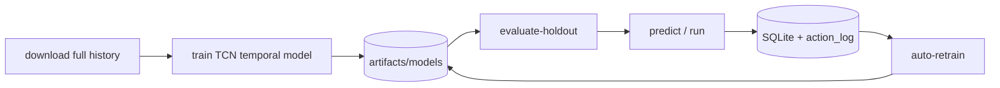

# Get Started with epochAI

A simple, command-first guide from a fresh clone to a trained predictor and paper-trading
bot. Pick your **hardware profile** (CPU, low-end GPU, or high-end GPU) and follow that
column — every step works the same way, only a few `--set` flags change.

Run **all commands from the repository root**. Examples use **bash** (Linux/macOS).
On Windows, use `.venv\Scripts\Activate.ps1` and replace `\` line continuation with `` ` ``.

> **Paper-only by default.** Research and education software — not financial advice.
> Real-money order routing stays disabled unless you explicitly enable live mode with keys.

> **Real data required for training.** `train`, `retrain`, and `auto-retrain` always use
> exchange OHLCV (or a provenanced parquet cache). Synthetic fallback is **off** by default
> and is only for pytest/CI — not production training.

---

## What you are building

epochAI learns **out-of-sample** on historical 5-minute BTC/USDT data, predicts six
horizons (5m → 4h) with calibrated P(up) and quantile bands, and feeds a separate
**execution layer** that turns forecasts into paper trades.



The flow is always the same: **setup → download real data → train → holdout check →
predict → run → auto-retrain.**

---

## Pick your hardware profile

Production defaults in `config/config.yaml` (2026-06):

- **`timeframe=5m`** — 5-minute base bars; horizons `[1,3,6,12,24,48]` (5m → 4h), primary 1h
- **`model.backend=tcn`** — causal Temporal Convolutional Network over a sliding window
  of the last **`tcn.lookback=96`** feature rows (8h); learns temporal structure directly
- **`tcn.channels=[64,64,128,128]`**, **`use_synthetic_fallback=false`**

| Profile | Use when | Train command extras |
| --- | --- | --- |
| **CPU** | No NVIDIA GPU | `--set model.device=cpu` |
| **GPU low** | 4–8 GB VRAM (T4, 3060) | `--set model.device=cuda` + lower `tcn.batch_size` |
| **GPU high** | 16–48 GB VRAM (3090, 4090, A6000) | `--set model.device=cuda` (defaults are already tuned) |

Alternative backends (dense MLP or tabular GBM):

```bash
python -m epoch_ai train --fresh --set model.backend=evolved_nn --set model.device=cuda
python -m epoch_ai train --fresh --set model.backend=xgboost --set model.device=cuda
```

---

## 0. One-time setup (all profiles)

**Requires Python 3.12+.** See `README.md` § Install dependencies for Linux/macOS/Windows
install paths (Ubuntu 20.04 needs pyenv).

```bash
python3.12 -m venv .venv
source .venv/bin/activate
python -m pip install -U pip
pip install -r requirements.txt -r requirements-dev.txt
pip install torch                    # GPU: see https://pytorch.org for cu121/cu124 wheel
pip install -r requirements-optional.txt   # ccxt, xgboost, etc.
pip install ccxt                     # required for live download
```

Confirm install and resolved config:

```bash
python -m epoch_ai info
```

---

## 1. Download real market data (all profiles)

**Required before the first train.** The downloader fetches OHLCV plus context feeds,
cleans them, caches parquet under `artifacts/data/`, and writes a **provenance sidecar**
(`*.provenance.json`, `source: exchange`). Training rejects synthetic or unprovenanced
caches.

### Production (full history)

```bash
python -m epoch_ai download --full-history
```

First run can take a long time (multi-year 5m BTC + context symbols). Re-runs extend the
cache forward from the last timestamp.

### Legacy cache / “no provenance” error

If `train` fails with *no provenance metadata*, re-download:

```bash
python -m epoch_ai download --full-history --force
```

### Capped run (smoke or limited RAM)

```bash
python -m epoch_ai download --bars 20000
```

Why 20000? Default 5m config uses `initial_train_period=8640` (~30 days); feature warm-up
and label filtering drop a large fraction of raw rows. **~20,000 bars** is the practical
minimum for a default-config train.

| Flag | Purpose |
| --- | --- |
| `--full-history` | Backfill from exchange start (`historical_start_date: earliest`) |
| `--bars N` | Fetch the most recent N bars |
| `--force` | Re-fetch primary symbol (rewrites cache + provenance) |
| `--symbol ETH/USDT` | Override primary symbol |

**Context symbols** (ETH/SOL/BNB/DOGE) must cover the same time range as BTC for
`features.cross_asset` to work. Extend their caches or temporarily disable:

```bash
python -m epoch_ai train --set features.cross_asset=false
```

---

## 2. Train (choose your profile)

Walk-forward loop: train on oldest window → predict next unseen slice → expand → repeat.
Omit `--log-predictions` on very long full-history runs (CPU-heavy); add it on shorter
runs if you plan to use `retrain` from SQLite logs.

### Default production (GPU high — uses shipped config)

```bash
python -m epoch_ai train --set model.device=cuda
```

Resume after Ctrl+C (same command):

```bash
python -m epoch_ai train --set model.device=cuda
```

Fresh start from step 0:

```bash
python -m epoch_ai train --fresh --set model.device=cuda
```

### GPU low (4–8 GB VRAM)

```bash
python -m epoch_ai train --set model.device=cuda \
  --set model.tcn.batch_size=128 \
  --set model.tcn.channels=[32,32,64]
```

### CPU

```bash
python -m epoch_ai train --set model.device=cpu
```

### Fast plumbing smoke (~minutes, still real data if cache exists)

```bash
python -m epoch_ai download --bars 8000
python -m epoch_ai train --bars 8000 --max-steps 12 --fresh \
  --set model.device=cpu \
  --set walk_forward.initial_train_period=800 \
  --set walk_forward.step_size=200 \
  --set execution.min_buffer_bars=500
```

### Holdout gate (recommended after train)

```bash
python -m epoch_ai evaluate-holdout
```

### Common train flags

| Flag | When to use |
| --- | --- |
| `--bars N` | Cap to N cached bars (omit for full cache) |
| `--log-predictions` | SQLite OOS log (needed for `retrain`; slow on huge runs) |
| `--max-steps N` | Cap walk-forward iterations (smokes) |
| `--refresh-data` | Re-download before train |
| `--full-history` | Train after full backfill target |
| `--fresh` | Delete checkpoint; restart step 0 |
| `--no-resume` | Ignore checkpoint file |
| `--set model.evolution.fast_fit=false` | Re-enable evolution search (slow; research only) |

Progress without training:

```bash
python -m epoch_ai progress
python -m epoch_ai progress --watch --interval 5
```

Models land in `artifacts/models/v_*/`; checkpoints in `artifacts/checkpoints/`.

### Tuning quick reference (shipped `config/config.yaml`)

| Knob | Shipped default | GPU low override |
| --- | --- | --- |
| `model.backend` | `tcn` | `tcn` |
| `model.tcn.lookback` | `96` | `96` |
| `model.tcn.channels` | `[64,64,128,128]` | `[32,32,64]` |
| `model.tcn.batch_size` | `256` | `128` |
| `model.device` | `auto` | `cuda` |
| `data.use_synthetic_fallback` | `false` | `false` |
| `walk_forward.retrain_frequency` | `5` | `5` |

Permanent changes: edit `config/config.yaml` instead of repeating `--set`.

---

## 3. Inspect forecasts

```bash
python -m epoch_ai predict
python -m epoch_ai predict --json
```

---

## 4. Run the bot (paper / replay)

```bash
python -m epoch_ai run --bars 6000 --live-bars 300 --replay \
  --log-predictions --long-threshold 0.5 --short-threshold 0.5
```

Simulated live feed (offline replay):

```bash
python -m epoch_ai run --live-feed --bars 6000 --live-bars 300 --log-predictions
```

---

## 5. Keep improving (retrain loop)

```bash
# Refresh real data, then safe challenger/champion gate (recommended)
python -m epoch_ai download --full-history
python -m epoch_ai auto-retrain

# Or scheduled daily loop
python -m epoch_ai schedule-retrain --promote --interval-hours 24 --max-cycles 1000
```

Retrain from SQLite logs only (needs prior `--log-predictions`):

```bash
python -m epoch_ai retrain --min-new-samples 50
```

Full walk-forward retrain on updated history:

```bash
python -m epoch_ai train --set model.device=cuda
```

---

## Cheat sheet (production GPU path)

```bash
# Setup (once)
python3.12 -m venv .venv && source .venv/bin/activate
pip install -U pip
pip install -r requirements.txt -r requirements-dev.txt
pip install torch ccxt
pip install -r requirements-optional.txt

python -m epoch_ai info
python -m epoch_ai download --full-history

python -m epoch_ai train --set model.device=cuda
python -m epoch_ai evaluate-holdout
python -m epoch_ai predict --json

python -m epoch_ai run --bars 6000 --live-bars 300 --replay \
  --long-threshold 0.5 --short-threshold 0.5

python -m epoch_ai auto-retrain
```

---

## Developer / CI only (synthetic data)

**Not for production training.** Pytest uses in-memory synthetic fixtures. To run an
offline pipeline smoke with fake OHLCV (no exchange):

```bash
python -m epoch_ai download --bars 8000 \
  --set data.use_synthetic_fallback=true \
  --set data.context_symbols=[]
python -m epoch_ai backtest --bars 8000 --max-steps 12 \
  --set data.use_synthetic_fallback=true
```

`train` will still **reject** synthetic caches — use `backtest` for offline demos.

---

## Command reference

| Command | Purpose |
| --- | --- |
| `info` | Print resolved YAML config |
| `download` | Fetch/cache real OHLCV + provenance (run before train) |
| `train` | Progressive walk-forward train + registry (primary) |
| `progress` | Walk-forward position; `--watch` for live view |
| `predict` | Multi-horizon forecast table / `--json` |
| `evaluate-holdout` | Score on untouched final tail |
| `run` | Load registry model; paper / replay / live-feed |
| `retrain` | Retrain from SQLite logs or real parquet fallback |
| `auto-retrain` | Challenger/champion gate |
| `schedule-retrain` | Periodic retrain loop (`--promote`) |
| `backtest` | Walk-forward + trading metrics (offline smoke OK) |
| `export` | Open-weights bundle + model card |

Global flags: `--config path`, `--symbol BTC/USDT`, `--set key=value`, `-v`.

---

## Where artifacts live

| Path | Contents |
| --- | --- |
| `artifacts/data/*.parquet` | Cached market history |
| `artifacts/data/*.provenance.json` | `exchange` / `synthetic` source tag |
| `artifacts/models/v_*/` | Versioned open-weights models |
| `artifacts/models/current.json` | Promoted champion pointer |
| `artifacts/checkpoints/` | Walk-forward resume JSON |
| `artifacts/logs/predictions.sqlite` | Prediction/outcome store (cumulative) |

Do not delete `artifacts/` casually — SQLite logs and checkpoints are cumulative.

---

## Development checks

```bash
.venv/bin/ruff check .
.venv/bin/python -m pytest -m "not slow"
.venv/bin/python -m pytest
```

---

## Further reading

- `README.md` — overview, Python install, progressive-learning parameters
- `docs/runbook.md` — operator runbook (kill switch, treasury, live seam)
- `docs/adr/0008-multi-horizon-and-learned-policy.md` — multi-head + RL boundary
- `AGENTS.md` — agent/cloud gotchas (real-data policy, GPU profiles)
