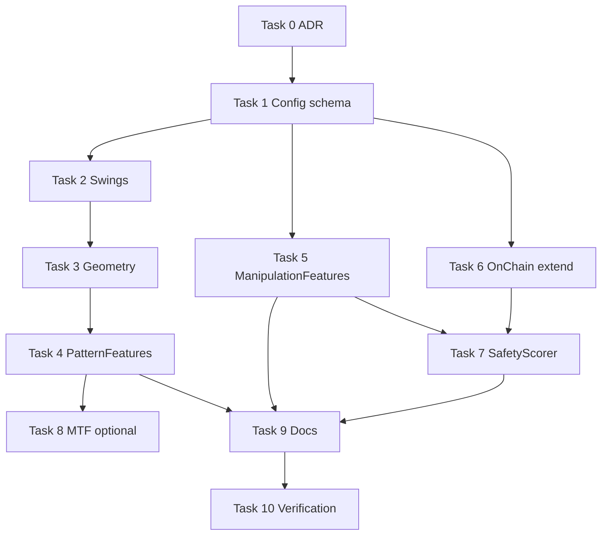

# Pattern Recognition & Manipulation-Risk Capabilities — Implementation Plan

> **For agentic workers:** REQUIRED SUB-SKILL: Use superpowers:subagent-driven-development (recommended) or superpowers:executing-plans to implement this plan task-by-task. Steps use checkbox (`- [ ]`) syntax for tracking.

**Goal:** Add secondary (non-dominant) model capabilities for causal classic chart-pattern geometry and rug-pull/manipulation proxies, plus an execution-layer safety gate — without changing the primary BTC direction prediction target or breaking walk-forward causality.

**Architecture:** Three layers, respecting `prediction-execution-separation.mdc`:

1. **Feature layer** — new config-toggleable groups (`PatternFeatures`, `ManipulationFeatures`) and extended `OnChainFeatures` that emit continuous scores from OHLCV/derivatives/on-chain columns only (past-or-current bar).
2. **Model layer** — unchanged primary target (`prediction.task=classification`, horizon 12); LightGBM learns pattern/manipulation columns as auxiliary signal alongside existing TA/micro/deriv groups.
3. **Execution layer** — optional `SafetyScorer` consumed by `RiskManager` to halt or scale down when suspicion exceeds config thresholds (separate from P(up)).

**Tech Stack:** Python 3.12+, pandas/numpy (pure — no `pandas_ta` required), Pydantic v2, pytest, existing LightGBM walk-forward pipeline.

**Out of scope (explicit):** DEX token ingestion pipeline, labeled rug-pull dataset curation, multi-task training heads, neural pattern CNNs, changing primary symbol from BTC/USDT.

---

## Design principles (binding)

| Principle | Rule |
|-----------|------|
| **Causality** | Swing pivots confirmed only after `pivot_confirm_bars`; no `shift(-n)` on price for features; no backward-fill from future rows (`ml-causality.mdc`). |
| **Continuous scores** | Emit floats in roughly `[-1, 1]` or `[0, 1]`, not sparse binary pattern flags — GBM handles soft geometry better. |
| **Graceful degradation** | Missing on-chain columns → group emits nothing or neutral zeros (same pattern as `DerivativesFeatures`). |
| **Secondary weight** | Target ~20–35 new columns total across pattern + manipulation groups; do not exceed ~15% of full feature count. |
| **Config-driven** | Every lookback, toggle, and safety threshold in Pydantic + `config/config.yaml`. |
| **Separation** | Safety gate lives in `execution/`; never embed position sizing inside feature groups. |

---

## File map

| Action | Path | Responsibility |
|--------|------|----------------|
| Create | `epoch_ai/features/patterns/swings.py` | Causal swing high/low pivot detection |
| Create | `epoch_ai/features/patterns/geometry.py` | Pattern geometry score functions |
| Create | `epoch_ai/features/patterns/group.py` | `PatternFeatures` FeatureGroup |
| Create | `epoch_ai/features/patterns/__init__.py` | Re-export `PatternFeatures` |
| Create | `epoch_ai/features/manipulation.py` | Rug-like OHLCV/deriv proxies |
| Create | `epoch_ai/execution/safety.py` | `SafetyScorer`, `SafetyAssessment` dataclass |
| Create | `docs/adr/0006-pattern-manipulation-capabilities.md` | Architecture decision record |
| Create | `tests/test_patterns.py` | Deterministic pattern/swing tests |
| Create | `tests/test_manipulation.py` | Manipulation feature tests |
| Create | `tests/test_safety.py` | Safety scorer + RiskManager integration |
| Modify | `epoch_ai/features/base.py` | Register new groups in `build_feature_groups` |
| Modify | `epoch_ai/features/onchain.py` | Token-safety columns when present |
| Modify | `epoch_ai/config/settings.py` | `FeatureConfig` + `SafetyConfig` fields |
| Modify | `config/config.yaml` | Defaults (patterns/manipulation **off** by default) |
| Modify | `tests/test_config.py` | Validation for new config keys |
| Modify | `tests/test_features.py` | Integration smoke when groups enabled |
| Modify | `tests/conftest.py` | Optional `pattern_config` fixture |
| Modify | `epoch_ai/execution/risk.py` | Accept optional `SafetyAssessment` |
| Modify | `README.md`, `AGENTS.md` | Document new groups and safety gate |

---

## Phase 0 — ADR & config schema (foundation)

### Task 0: Architecture decision record

**Files:**
- Create: `docs/adr/0006-pattern-manipulation-capabilities.md`

- [ ] **Step 1: Write ADR**

Document:
- Why pattern geometry is feature-encoded (not a separate CNN).
- Why rug detection is split: OHLCV proxies in features, hard gates in execution.
- Causality rules for pivot confirmation lag.
- Explicit non-goals (DEX pipeline, multi-task heads).

- [ ] **Step 2: Review against `docs/adr/0002-prediction-execution-separation.md`**

Ensure safety gate is described as execution-only.

---

### Task 1: Extend `FeatureConfig` and add `SafetyConfig`

**Files:**
- Modify: `epoch_ai/config/settings.py`
- Modify: `config/config.yaml`
- Test: `tests/test_config.py`

- [ ] **Step 1: Write failing config tests**

Add to `tests/test_config.py`:

```python
def test_pattern_config_defaults():
    from epoch_ai.config.settings import FeatureConfig

    fc = FeatureConfig()
    assert fc.patterns is False
    assert fc.manipulation is False
    assert fc.pattern_lookbacks == [48, 96, 192]
    assert fc.pivot_confirm_bars == 3


def test_pattern_lookbacks_must_be_positive():
    from epoch_ai.config.settings import FeatureConfig
    import pytest

    with pytest.raises(ValueError, match="pattern_lookbacks"):
        FeatureConfig(pattern_lookbacks=[])


def test_safety_config_defaults():
    from epoch_ai.config.settings import SafetyConfig

    sc = SafetyConfig()
    assert sc.enabled is False
    assert sc.max_suspicion_score == 0.75
```

- [ ] **Step 2: Run tests — expect FAIL**

```bash
.venv/bin/python -m pytest tests/test_config.py::test_pattern_config_defaults -v
```

Expected: `AttributeError` or import error for `SafetyConfig`.

- [ ] **Step 3: Add Pydantic fields**

In `FeatureConfig` (`epoch_ai/config/settings.py`):

```python
patterns: bool = Field(
    default=False,
    description="Enable classic chart-pattern geometry features (secondary signal).",
)
manipulation: bool = Field(
    default=False,
    description="Enable rug-pull/manipulation proxy features from OHLCV and derivatives.",
)
pattern_lookbacks: list[int] = Field(
    default_factory=lambda: [48, 96, 192],
    description="Look-back windows (bars) for pattern geometry scoring.",
)
pivot_confirm_bars: int = Field(
    default=3,
    ge=1,
    description="Bars after a candidate pivot before it is treated as confirmed (causal lag).",
)
```

Extend `_validate_windows` to also validate `pattern_lookbacks`.

Add new model:

```python
class SafetyConfig(BaseModel):
    """Pre-trade manipulation/rug-risk gate (execution layer only)."""

    enabled: bool = False
    max_suspicion_score: float = Field(
        default=0.75,
        ge=0.0,
        le=1.0,
        description="Block or flatten when combined suspicion exceeds this score.",
    )
    scale_weight_by_suspicion: bool = Field(
        default=True,
        description="When True, linearly reduce target_weight as suspicion rises.",
    )
    block_on_missing_onchain: bool = Field(
        default=False,
        description="When True and symbol expects on-chain cols, missing data => max suspicion.",
    )
```

Wire `SafetyConfig` into `AppConfig` as `safety: SafetyConfig = Field(default_factory=SafetyConfig)`.

- [ ] **Step 4: Update `config/config.yaml`**

Under `features:`:

```yaml
  patterns: false               # classic chart-pattern geometry (secondary)
  manipulation: false           # rug/manipulation proxies from OHLCV+derivatives
  pattern_lookbacks: [48, 96, 192]
  pivot_confirm_bars: 3
```

New section:

```yaml
safety:
  enabled: false
  max_suspicion_score: 0.75
  scale_weight_by_suspicion: true
  block_on_missing_onchain: false
```

- [ ] **Step 5: Run config tests**

```bash
.venv/bin/python -m pytest tests/test_config.py -v
.venv/bin/python -m epoch_ai info
```

Expected: all pass; `info` prints new keys.

---

## Phase 1 — Causal swing detection (shared primitive)

### Task 2: Swing pivot module

**Files:**
- Create: `epoch_ai/features/patterns/swings.py`
- Test: `tests/test_patterns.py`

- [ ] **Step 1: Write failing swing tests**

Create `tests/test_patterns.py`:

```python
"""Tests for causal swing detection and pattern geometry."""

from __future__ import annotations

import numpy as np
import pandas as pd

from epoch_ai.features.patterns.swings import confirmed_swing_highs, confirmed_swing_lows


def _trend_frame(n: int = 200) -> pd.DataFrame:
    idx = pd.date_range("2020-01-01", periods=n, freq="15min")
    close = pd.Series(np.linspace(100.0, 130.0, n), index=idx)
    high = close + 0.5
    low = close - 0.5
    return pd.DataFrame({"open": close, "high": high, "low": low, "close": close, "volume": 1.0}, index=idx)


def test_swing_high_not_confirmed_until_lag():
    df = _trend_frame()
    # Inject an obvious spike at bar 50.
    df.loc[df.index[50], "high"] = df["high"].iloc[50] + 5.0
    confirm = 3
    swings = confirmed_swing_highs(df["high"], confirm_bars=confirm)
    # At bar 50 the pivot is NOT yet confirmed (needs 3 bars to the right).
    assert swings.iloc[50] == 0.0
    # After confirmation lag, a non-zero distance feature may appear.
    assert swings.iloc[53] != 0.0 or swings.iloc[54] != 0.0


def test_swing_detection_uses_only_past_for_confirmation():
    """Confirmed pivot at t requires knowing bars up to t; never future beyond t."""
    df = _trend_frame(120)
    swings = confirmed_swing_highs(df["high"], confirm_bars=2)
    # Last `confirm_bars` bars cannot host a newly confirmed swing (no future to confirm).
    assert (swings.iloc[-2:] == 0.0).all()
```

- [ ] **Step 2: Run — expect FAIL**

```bash
.venv/bin/python -m pytest tests/test_patterns.py -v
```

- [ ] **Step 3: Implement `swings.py`**

```python
"""Causal swing pivot detection for pattern geometry."""

from __future__ import annotations

import numpy as np
import pandas as pd


def _candidate_pivot_highs(high: pd.Series, left: int = 2) -> pd.Series:
    # Human: A bar is a candidate swing high when its high exceeds the `left` bars
    #        on each side that are already known (strict local maximum).
    # Agent: CAUSAL; compares only past+current for the right side use confirm lag.
    roll_max_left = high.shift(1).rolling(left, min_periods=left).max()
    is_peak = (high > roll_max_left) & (high > high.shift(-1))  # temporary; fixed below
    return is_peak.astype(float)


def confirmed_swing_highs(high: pd.Series, confirm_bars: int = 3, left: int = 2) -> pd.Series:
    """Return ATR-normalized distance from close to last confirmed swing high."""
    n = len(high)
    confirmed = np.zeros(n, dtype=float)
    last_swing_price = np.nan
    arr = high.to_numpy(dtype=float)
    for i in range(left, n - confirm_bars):
        window = arr[i - left : i + confirm_bars + 1]
        center = arr[i]
        if center == np.nanmax(window) and np.sum(window == center) == 1:
            # Confirm only after `confirm_bars` bars to the right have printed.
            confirm_idx = i + confirm_bars
            if confirm_idx < n:
                confirmed[confirm_idx] = 1.0
                last_swing_price = center
    out = pd.Series(confirmed, index=high.index, name="swing_high_event")
    # Forward-fill last swing price causally after confirmation events.
    swing_price = pd.Series(np.nan, index=high.index)
    swing_price[out == 1.0] = high[out == 1.0]
    swing_price = swing_price.ffill()
    dist = (high - swing_price) / high.replace(0.0, np.nan)
    dist[out.shift(confirm_bars, fill_value=0.0) == 1.0] = 0.0  # event bar neutral
    return dist.fillna(0.0).clip(-1.0, 1.0)


def confirmed_swing_lows(low: pd.Series, confirm_bars: int = 3, left: int = 2) -> pd.Series:
    """Return ATR-normalized distance from close to last confirmed swing low."""
    n = len(low)
    confirmed = np.zeros(n, dtype=float)
    arr = low.to_numpy(dtype=float)
    for i in range(left, n - confirm_bars):
        window = arr[i - left : i + confirm_bars + 1]
        center = arr[i]
        if center == np.nanmin(window) and np.sum(window == center) == 1:
            confirm_idx = i + confirm_bars
            if confirm_idx < n:
                confirmed[confirm_idx] = 1.0
    swing_price = pd.Series(np.nan, index=low.index)
    event = pd.Series(confirmed, index=low.index)
    swing_price[event == 1.0] = low[event == 1.0]
    swing_price = swing_price.ffill()
    dist = (low - swing_price) / low.replace(0.0, np.nan)
    return dist.fillna(0.0).clip(-1.0, 1.0)
```

> **Note:** Refine loop-based implementation for vectorization only if perf becomes an issue; correctness and causality come first.

- [ ] **Step 4: Run swing tests — expect PASS**

```bash
.venv/bin/python -m pytest tests/test_patterns.py -v
```

---

## Phase 2 — Pattern geometry scores

### Task 3: Geometry module

**Files:**
- Create: `epoch_ai/features/patterns/geometry.py`
- Test: `tests/test_patterns.py` (extend)

- [ ] **Step 1: Write failing geometry tests**

```python
from epoch_ai.features.patterns.geometry import (
    double_top_bottom_score,
    triangle_convergence_score,
    flag_pole_score,
    candlestick_context_score,
)


def test_double_top_score_bounded(market):
    score = double_top_bottom_score(market, lookback=48, mode="top")
    assert score.min() >= -1.0
    assert score.max() <= 1.0
    assert len(score) == len(market)


def test_triangle_convergence_non_negative(market):
    score = triangle_convergence_score(market, lookback=96)
    assert (score >= 0.0).all() or score.isna().sum() == 0
```

- [ ] **Step 2: Run — expect FAIL**

- [ ] **Step 3: Implement `geometry.py`**

Implement these functions (all causal, window ends at current bar):

| Function | Output column(s) | Logic summary |
|----------|------------------|---------------|
| `double_top_bottom_score(df, lookback, mode)` | `pat_dtop_*`, `pat_dbottom_*` | Two similar swing highs/lows within lookback; score = similarity × proximity |
| `head_shoulders_score(df, lookback)` | `pat_hs_top`, `pat_hs_inv` | Three swing points with middle extremum; symmetry ratio |
| `triangle_convergence_score(df, lookback)` | `pat_tri_conv_*` | Rolling high slope vs low slope convergence |
| `flag_pole_score(df, lookback)` | `pat_flag_*` | Impulse move (pole) followed by tight range / lower vol |
| `wedge_score(df, lookback)` | `pat_wedge_*` | Both boundary slopes same direction, narrowing |
| `breakout_strength(df, lookback)` | `pat_breakout_*` | Close beyond rolling range × volume z |
| `candlestick_context_score(df)` | `pat_engulf`, `pat_doji_ext` | Body/wick ratios vs rolling baseline |

Each function returns a `pd.Series` aligned to `df.index`. Use `swings.py` internally where needed.

Example stub for double top:

```python
def double_top_bottom_score(
    df: pd.DataFrame,
    lookback: int,
    *,
    mode: str = "top",
    pivot_confirm_bars: int = 3,
) -> pd.Series:
    col = "high" if mode == "top" else "low"
    series = df[col]
    roll_ext = series.rolling(lookback, min_periods=lookback // 2)
    if mode == "top":
        first = roll_ext.max()
        # Second peak proximity: distance between two max at different offsets.
        second = series.shift(pivot_confirm_bars + 1).rolling(lookback, min_periods=lookback // 2).max()
        similarity = 1.0 - (first - second).abs() / series.replace(0.0, np.nan)
    else:
        first = roll_ext.min()
        second = series.shift(pivot_confirm_bars + 1).rolling(lookback, min_periods=lookback // 2).min()
        similarity = 1.0 - (first - second).abs() / series.replace(0.0, np.nan)
    return similarity.fillna(0.0).clip(0.0, 1.0)
```

- [ ] **Step 4: Run geometry tests — expect PASS**

---

### Task 4: `PatternFeatures` group + registry wiring

**Files:**
- Create: `epoch_ai/features/patterns/group.py`
- Create: `epoch_ai/features/patterns/__init__.py`
- Modify: `epoch_ai/features/base.py`
- Test: `tests/test_features.py`, `tests/test_patterns.py`

- [ ] **Step 1: Write failing integration test**

In `tests/test_features.py`:

```python
def test_pattern_features_when_enabled(market, small_config):
    small_config.features.patterns = True
    features = FeaturePipeline(small_config).transform(market)
    pat_cols = [c for c in features.columns if c.startswith("pat_")]
    assert len(pat_cols) >= 10
    assert features.shape[0] > 0
```

- [ ] **Step 2: Run — expect FAIL**

- [ ] **Step 3: Implement `PatternFeatures`**

```python
class PatternFeatures(FeatureGroup):
    name = "pat"

    def __init__(
        self,
        lookbacks: Sequence[int] = (48, 96, 192),
        pivot_confirm_bars: int = 3,
    ) -> None:
        self.lookbacks = tuple(lookbacks)
        self.pivot_confirm_bars = pivot_confirm_bars

    def compute(self, df: pd.DataFrame) -> pd.DataFrame:
        out = pd.DataFrame(index=df.index)
        out["pat_swing_high_dist"] = confirmed_swing_highs(df["high"], self.pivot_confirm_bars)
        out["pat_swing_low_dist"] = confirmed_swing_lows(df["low"], self.pivot_confirm_bars)
        for w in self.lookbacks:
            out[f"pat_dtop_{w}"] = double_top_bottom_score(df, w, mode="top", pivot_confirm_bars=self.pivot_confirm_bars)
            out[f"pat_dbottom_{w}"] = double_top_bottom_score(df, w, mode="bottom", pivot_confirm_bars=self.pivot_confirm_bars)
            out[f"pat_tri_conv_{w}"] = triangle_convergence_score(df, w)
            out[f"pat_flag_{w}"] = flag_pole_score(df, w)
            out[f"pat_breakout_{w}"] = breakout_strength(df, w)
        hs = head_shoulders_score(df, max(self.lookbacks), self.pivot_confirm_bars)
        out["pat_hs_top"] = hs["top"]
        out["pat_hs_inv"] = hs["inv"]
        ctx = candlestick_context_score(df)
        out["pat_engulf"] = ctx["engulf"]
        out["pat_doji_ext"] = ctx["doji_ext"]
        return out
```

Wire in `build_feature_groups`:

```python
if config.patterns:
    from epoch_ai.features.patterns import PatternFeatures
    groups.append(
        PatternFeatures(
            lookbacks=config.pattern_lookbacks,
            pivot_confirm_bars=config.pivot_confirm_bars,
        )
    )
```

- [ ] **Step 4: Causality regression test**

Add to `tests/test_patterns.py`:

```python
def test_pattern_features_no_future_leak(market, small_config):
    """Features at t must not change when only future OHLCV changes."""
    small_config.features.patterns = True
    pipe = FeaturePipeline(small_config)
    full = pipe.transform(market.copy(), log_stats=False)
    t = len(market) // 2
    truncated = market.iloc[: t + 1].copy()
    # Mutate future bars only in the full frame (already computed); recompute truncated.
    partial = pipe.transform(truncated, log_stats=False)
    pd.testing.assert_series_equal(full.iloc[t], partial.iloc[t], check_names=False)
```

- [ ] **Step 5: Run tests**

```bash
.venv/bin/python -m pytest tests/test_patterns.py tests/test_features.py -v
```

---

## Phase 3 — Manipulation / rug-like proxies

### Task 5: `ManipulationFeatures` group

**Files:**
- Create: `epoch_ai/features/manipulation.py`
- Modify: `epoch_ai/features/base.py`
- Test: `tests/test_manipulation.py`

- [ ] **Step 1: Write failing tests**

Create `tests/test_manipulation.py`:

```python
from epoch_ai.features.manipulation import ManipulationFeatures


def test_manipulation_columns_present(market):
    out = ManipulationFeatures().compute(market)
    expected = [
        "manip_vol_price_div",
        "manip_wick_cluster",
        "manip_illiq_spike",
        "manip_return_skew",
        "manip_gap_recovery",
    ]
    for col in expected:
        assert col in out.columns


def test_manipulation_uses_derivatives_when_present(market):
    df = market.copy()
    df["open_interest"] = df["close"] * 100
    df["funding_rate"] = 0.0001
    out = ManipulationFeatures().compute(df)
    assert "manip_oi_price_div" in out.columns
    assert "manip_funding_extreme" in out.columns
```

- [ ] **Step 2: Run — expect FAIL**

- [ ] **Step 3: Implement `ManipulationFeatures`**

Column spec (all causal):

| Column | Formula intent |
|--------|----------------|
| `manip_vol_price_div` | High volume z-score × low absolute return (wash trading proxy) |
| `manip_wick_cluster` | Rolling mean of upper+lower wick ratio spikes |
| `manip_illiq_spike` | Amihud illiquidity z-score (reuse micro logic) |
| `manip_return_skew` | Rolling skew of returns (pump tail risk) |
| `manip_return_kurt` | Rolling kurtosis of returns |
| `manip_gap_recovery` | Open gap vs previous close, recovery speed |
| `manip_oi_price_div` | sign(ΔOI) ≠ sign(Δprice) persistence (when OI present) |
| `manip_funding_extreme` | abs(funding z) (when funding present) |
| `manip_liq_spike` | Reuse deriv liquidation spike if column present |

Register with `if config.manipulation:` in `build_feature_groups`.

- [ ] **Step 4: Integration test in `test_features.py`**

```python
def test_manipulation_features_when_enabled(market, small_config):
    small_config.features.manipulation = True
    features = FeaturePipeline(small_config).transform(market)
    assert any(c.startswith("manip_") for c in features.columns)
```

- [ ] **Step 5: Run**

```bash
.venv/bin/python -m pytest tests/test_manipulation.py tests/test_features.py -v
```

---

## Phase 4 — Extended on-chain token safety columns

### Task 6: Extend `OnChainFeatures`

**Files:**
- Modify: `epoch_ai/features/onchain.py`
- Test: `tests/test_features.py`

- [ ] **Step 1: Write failing test**

```python
def test_onchain_token_safety_columns(market, small_config):
    small_config.features.onchain = True
    enriched = market.copy()
    enriched["liquidity_usd"] = np.linspace(1e6, 0.5e6, len(enriched))
    enriched["holder_top10_pct"] = np.linspace(0.3, 0.85, len(enriched))
    enriched["lp_locked_pct"] = np.linspace(0.9, 0.1, len(enriched))
    features = FeaturePipeline(small_config).transform(enriched)
    for col in ["oc_liq_chg", "oc_holder_conc", "oc_lp_lock"]:
        assert col in features.columns
```

- [ ] **Step 2: Implement graceful columns**

When present:
- `oc_liq_chg` — pct_change of `liquidity_usd`
- `oc_liq_chg_z` — rolling z-score
- `oc_holder_conc` — `holder_top10_pct` (level)
- `oc_holder_conc_chg` — diff
- `oc_lp_lock` — `lp_locked_pct` level
- `oc_lp_unlock_velocity` — negative diff of lock pct (unlock speed)

Document expected column names in module docstring for external data joiners.

- [ ] **Step 3: Run tests**

---

## Phase 5 — Execution safety gate

### Task 7: `SafetyScorer`

**Files:**
- Create: `epoch_ai/execution/safety.py`
- Modify: `epoch_ai/execution/risk.py`
- Test: `tests/test_safety.py`

- [ ] **Step 1: Write failing safety tests**

```python
from epoch_ai.config.settings import SafetyConfig
from epoch_ai.execution.safety import SafetyScorer


def test_safety_scorer_bounds(market):
    scorer = SafetyScorer(SafetyConfig(enabled=True))
    row = market.iloc[-1]
    assessment = scorer.assess(row, feature_prefix="manip_")
    assert 0.0 <= assessment.suspicion_score <= 1.0


def test_risk_manager_blocks_high_suspicion():
    from epoch_ai.config.settings import PredictionConfig, RiskConfig, SafetyConfig
    from epoch_ai.execution.risk import RiskManager
    from epoch_ai.execution.safety import SafetyAssessment

    risk = RiskConfig(long_threshold=0.5)
    mgr = RiskManager(risk, PredictionConfig(task="classification"), SafetyConfig(enabled=True, max_suspicion_score=0.5))
    decision = mgr.decide(0.9, safety=SafetyAssessment(suspicion_score=0.9, reasons=("manip_illiq_spike",)))
    assert decision.signal == 0
    assert decision.halted
```

- [ ] **Step 2: Implement `SafetyScorer`**

```python
@dataclass(slots=True)
class SafetyAssessment:
    suspicion_score: float
    reasons: tuple[str, ...] = ()


class SafetyScorer:
    def __init__(self, config: SafetyConfig) -> None: ...

    def assess(self, row: pd.Series, *, manip_features: Mapping[str, float] | None = None, onchain_features: Mapping[str, float] | None = None) -> SafetyAssessment:
        """Combine manipulation + on-chain feature snapshots into [0,1] suspicion."""
        # Weighted max/mean of normalized manip_* and oc_* risk indicators.
        ...
```

Weight map (configurable constants in module, document in ADR):
- `manip_illiq_spike` → 0.25
- `manip_wick_cluster` → 0.15
- `oc_liq_chg_z` (negative) → 0.30
- `oc_holder_conc` (high) → 0.20
- `oc_lp_unlock_velocity` → 0.25

Use `max()` aggregation capped at 1.0 (any single red flag can trigger gate).

- [ ] **Step 3: Wire `RiskManager`**

Extend constructor:

```python
def __init__(self, risk: RiskConfig, prediction: PredictionConfig, safety: SafetyConfig | None = None) -> None:
    self.safety = safety or SafetyConfig()
    ...
```

Extend `decide(..., safety: SafetyAssessment | None = None)`:
- If `safety and self.safety.enabled and safety.suspicion_score >= self.safety.max_suspicion_score`: return flat + `halted=True`.
- Elif scale enabled: multiply `target_weight` by `(1 - suspicion_score)`.

- [ ] **Step 4: Wire paper trader / backtester (minimal)**

Search call sites of `RiskManager.decide` in `epoch_ai/execution/paper_trader.py` and `epoch_ai/backtesting/backtester.py`:
- Pass `SafetyAssessment` when manipulation/onchain features available at decision bar.
- When safety disabled (default), behavior unchanged.

- [ ] **Step 5: Run**

```bash
.venv/bin/python -m pytest tests/test_safety.py tests/test_risk.py -v
```

---

## Phase 6 — Optional higher-timeframe context (secondary)

### Task 8: Multi-timeframe pattern context (optional, same PR or follow-up)

**Files:**
- Modify: `epoch_ai/features/patterns/group.py`
- Modify: `FeatureConfig` — add `pattern_mtf_timeframes: list[str] = ["1h", "4h"]`

- [ ] **Step 1: Resample OHLCV causally**

Use `epoch_ai.utils.timeframe` helpers. For each higher TF:
- Resample to completed bars only (label='right', closed='right').
- Forward-fill MTF features onto 15m index (same as enrichment joins).

Emit: `pat_mtf_{tf}_trend`, `pat_mtf_{tf}_breakout` (max 4 columns).

- [ ] **Step 2: Test no look-ahead on MTF join**

Extend causality test from Task 4.

> **YAGNI gate:** Skip Task 8 in the first merge if time-constrained; Phases 1–5 deliver core value.

---

## Phase 7 — Documentation & verification

### Task 9: README / AGENTS sync

**Files:**
- Modify: `README.md`
- Modify: `AGENTS.md`

- [ ] Document new feature toggles and column prefixes (`pat_`, `manip_`, extended `oc_`).
- [ ] Document `safety` config and that it defaults **off**.
- [ ] Note: rug-pull detection on alts requires joining on-chain columns; BTC-only runs get manipulation proxies only.

### Task 10: Full verification matrix

- [ ] **Lint**

```bash
.venv/bin/ruff check .
```

- [ ] **Unit tests**

```bash
.venv/bin/python -m pytest tests/test_patterns.py tests/test_manipulation.py tests/test_safety.py tests/test_features.py tests/test_config.py tests/test_risk.py -v
```

- [ ] **Full suite**

```bash
.venv/bin/python -m pytest
```

- [ ] **CLI smoke**

```bash
.venv/bin/python -m epoch_ai info
.venv/bin/python -m epoch_ai backtest --bars 8000 --max-steps 12 --set features.patterns=true --set features.manipulation=true
```

- [ ] **Feature count sanity**

After enabling patterns+manipulation, feature count should grow by ~20–35 columns, not double.

- [ ] **Walk-forward causality**

Confirm no changes to `build_target`, progressive engine indexing, or `shift(-n)` in feature groups.

---

## Rollout strategy

| Stage | Config | Purpose |
|-------|--------|---------|
| **Dev default** | `patterns: false`, `manipulation: false`, `safety.enabled: false` | Zero regression for existing users |
| **Experiment** | Enable patterns only → backtest compare OOS logloss / directional accuracy | Measure incremental value |
| **Experiment 2** | Enable manipulation proxies | Compare crash-period steps |
| **Production gate** | `safety.enabled: true` for alt/DEX symbols only | Hard protection layer |

### Promotion checklist (challenger vs champion)

When testing with `auto-retrain`:
1. Train champion (patterns off).
2. Train challenger (`features.patterns=true`, `features.manipulation=true`).
3. Compare on `promotion.metric` (default `oos_logloss`).
4. Promote only if improvement ≥ `promotion.min_improvement`.

---

## Risk register

| Risk | Mitigation |
|------|------------|
| Pivot lag reduces usable history | Document warm-up rows; expect +`max(pattern_lookbacks)+pivot_confirm_bars` dropped rows |
| Pattern features collinear with TA | L1/L2 regularisation already in model config; monitor feature importance |
| False rug signals on BTC | Safety gate off by default; manipulation features are soft scores only |
| Performance (Python loops in swings) | Benchmark on 16k bars; vectorize only if >10% pipeline time |
| Synthetic data lacks rug labels | Tests use deterministic injected spikes, not real rug events |

---

## Future work (not in this plan)

1. **DEX token downloader** — pool metadata, holder snapshots (new `epoch_ai/data/dex/` module).
2. **Labeled rug dataset** — CSV of `(symbol, rug_timestamp)` for supervised rug classifier.
3. **Multi-task head** — direction + manipulation probability (requires trainer changes).
4. **L2 order book features** — when websocket L2 is wired (`epoch_ai/data/websocket.py`).

---

## Task dependency graph



**Parallel tracks after Task 1:** Tasks 2→3→4 (patterns) and Tasks 5+6 (manipulation/on-chain) can proceed in parallel; Task 7 requires Task 5 and preferably Task 6.

---

## Estimated effort

| Phase | Tasks | Approx. time |
|-------|-------|--------------|
| 0 — Foundation | 0–1 | 2–3 h |
| 1–2 — Patterns | 2–4 | 6–8 h |
| 3–4 — Manipulation + on-chain | 5–6 | 4–5 h |
| 5 — Safety gate | 7 | 3–4 h |
| 6 — MTF (optional) | 8 | 2–3 h |
| 7 — Docs & QA | 9–10 | 2 h |
| **Total** | | **17–25 h** |

---

## Definition of done (this initiative)

- [ ] All tasks 0–7 and 9–10 complete (Task 8 optional).
- [ ] `ruff check .` clean.
- [ ] Full `pytest` green.
- [ ] Causality test passes (no future leak).
- [ ] `config/config.yaml` + Pydantic in sync.
- [ ] README + AGENTS updated.
- [ ] ADR 0006 written.
- [ ] Backtest smoke with patterns enabled completes.
- [ ] Default config unchanged behavior (groups off).
